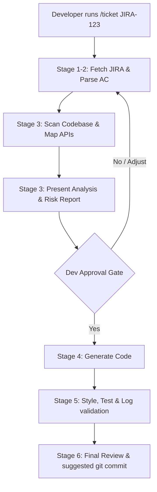

# ⚡ ticket2code

> **Turn JIRA tickets into production-ready code in seconds, safely.**

`ticket2code` is a lightweight, zero-dependency automation framework that bridges the gap between JIRA tickets and your IDE. Using a guided, stage-by-stage AI workflow, it analyzes requirements, scans your codebase, drafts an implementation plan, and writes clean, policy-compliant code—**all through a single slash command while keeping you in complete control.**

---

## 🔥 Why ticket2code?

Modern AI code generation is powerful, but direct generation without context leads to broken code, missing rules, and architecture drift. `ticket2code` solves this by introducing a structured **guided pipeline with a hard developer gate**.

- 🤖 **Context-Aware Scans**: Automatically maps JIRA requirements to impacted modules, files, and database schemas.
- 🛡️ **Safe by Design (Hard Gate)**: The AI *never* writes code without your explicit approval. It presents an Implementation & Risk Report first.
- 📏 **Automatic Rule Guardrails**: Verifies style, logging policies, and test requirements defined in your local `docs/` folder.
- 📦 **Zero-Config 5-Second Install**: Install, update, or configure in any repository with a single terminal command.

---

## ⚙️ How It Works (The Pipeline)



---

## 🚀 Quick Start (5-Second One-Liner)

To bootstrap `ticket2code` inside any target project, open your terminal at the root of your project and run:

### macOS / Linux / Git Bash (Recommended)
```bash
git clone --depth 1 https://github.com/tadev999/ticket2code.git /tmp/ticket2code && /tmp/ticket2code/bin/setup.sh . && rm -rf /tmp/ticket2code
```

### Windows (PowerShell)
```powershell
git clone --depth 1 https://github.com/tadev999/ticket2code.git $env:TEMP\ticket2code; powershell -ExecutionPolicy Bypass -File "$env:TEMP\ticket2code\bin\setup.ps1" .; Remove-Item -Recurse -Force $env:TEMP\ticket2code
```

---

## 🔄 Updating / Upgrading

To update the prompt configurations, scripts, and rule verifications to the latest version, **just re-run the installation command above**.

> [!TIP]
> **Safe Updates**: Re-running the installer is completely safe. It will overwrite system configuration prompts with the latest updates but will **never** overwrite your credentials in `.env.local` or modify your custom rules inside the `docs/` folder.

---

## 📦 Project Layout

```text
ticket2code/
├── README.md                # General introduction & setup guide
├── bin/
│   ├── setup.sh             # Setup script for macOS/Linux/Git Bash
│   └── setup.ps1            # Setup script for Windows PowerShell
└── ticket2code/
    └── ticket/              # /ticket command configuration & prompts
        ├── INDEX.md         # Detailed workflow & system design
        ├── SETUP.md         # Manual installation guidelines
        ├── env.local.example
        ├── ticket-agent.md  # System rules (System Prompt)
        ├── ticket-processor.prompt.md # Code logic instructions (Task Prompt)
        └── ticket.prompt.md # Entrypoint for IDE Chat
```

---

## 📖 Key Documentation

*   [Quick Start Setup Guide](./ticket2code/ticket/SETUP.md) — Steps to configure `.env.local` and IDE chat.
*   [Command Workflow & Stage Details](./ticket2code/ticket/INDEX.md) — Technical details of all execution stages.

---

## 🔒 Security & Privacy

- **No Data Leaks**: All JIRA API requests run locally on your system using your JIRA credentials.
- **Credential Protection**: `.env.local` is automatically added to `.gitignore` during setup to ensure you never commit secrets.
