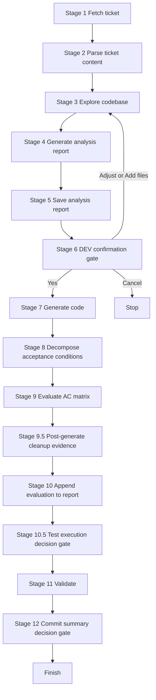

# ticket2code — `/ticket` command

> Turn a JIRA ticket into analysis report + production-ready code, with a mandatory human confirmation gate before any file is touched.

---

## Install in one command

**macOS / Linux / Git Bash**
```bash
git clone --depth 1 https://github.com/tadev999/ticket2code.git /tmp/ticket2code && /tmp/ticket2code/bin/setup.sh . && rm -rf /tmp/ticket2code
```

**Windows (PowerShell)**
```powershell
git clone --depth 1 https://github.com/tadev999/ticket2code.git $env:TEMP\ticket2code; powershell -ExecutionPolicy Bypass -File "$env:TEMP\ticket2code\bin\setup.ps1" .; Remove-Item -Recurse -Force $env:TEMP\ticket2code
```

Then configure credentials in `.env.local` — see [Step 2](#2-create-envlocal) below.

---

## Quick start (manual)

### 1. Add files to your repository

Copy `ticket.prompt.md` to `.github/prompts/` and copy the `ticket2code/` folder to your repo root.

### 2. Create `.env.local`

At the repo root, create `.env.local`:

```dotenv
JIRA_TOKEN=<your Atlassian API token>
JIRA_EMAIL=<your Atlassian account email>
JIRA_URL=<your JIRA base URL>
```

See [SETUP.md](SETUP.md) for step-by-step credential instructions.

### 3. Run

Open GitHub Copilot Chat and type:

```
/ticket PROJ-1234
```

---

## How it works


```mermaid
flowchart TD
    A[Stage 1 Fetch ticket] --> B[Stage 2 Parse ticket content]
    B --> C[Stage 3 Explore codebase]
    C --> D[Stage 4 Generate analysis report]
    D --> E[Stage 5 Save analysis report]
    E --> F[Stage 6 DEV confirmation gate]
    F -->|Yes| G[Stage 7 Generate code]
    F -->|Adjust or Add files| C
    F -->|Cancel| Z[Stop]

    G --> H[Stage 8 Decompose acceptance conditions]
    H --> I[Stage 9 Evaluate AC matrix]
    I --> J[Stage 9.5 Post-generate cleanup evidence]
    J --> K[Stage 10 Append evaluation to report]
    K --> L[Stage 10.5 Test execution decision gate]
    L --> M[Stage 11 Validate]
    M --> N[Stage 12 Commit summary decision gate]
    N --> O[Finish]
```

**The gate rule:** The agent never writes code without explicit DEV confirmation.

---

## File layout

```
ticket2code/ticket/
├── INDEX.md                    ← Architecture, stages, troubleshooting
├── SETUP.md                    ← Credential setup guide
├── env.local.example           ← .env.local template
├── ticket.prompt.md            ← Slash-command entry point
├── ticket-agent.md             ← Stage-by-stage behavior and workflow invariants
├── ticket-processor.prompt.md  ← Report schema and output templates
├── agent-specs/
│   ├── 01-stages.md
│   ├── 02-ac-decomposition.md
│   ├── 03-evaluation-rules.md
│   ├── 04-project-rules.md
│   └── 05-jira-policy.md
└── processor-specs/
    ├── 01-language-and-convention.md
    ├── 02-section-1-analysis.md
    ├── 03-section-2-evaluation.md
    ├── 04-section-3-conclusion.md
    ├── 05-cleanup-checklist.md
    ├── 06-decision-gates.md
    ├── 07-validation-checklist.md
    └── 08-decision-labels.md
```

---

## Requirements

- GitHub Copilot with agent mode enabled
- JIRA account with API token access
- Repository `docs/` folder with project rules (coding style, logging, test rules, review guidelines)
  — see [SETUP.md § Project rules](SETUP.md) for details

---

## Security

- Never commit `.env.local`. Add it to `.gitignore`.
- Never share `JIRA_TOKEN` via chat or email.
- If a token is compromised, revoke it immediately at [Atlassian API tokens](https://id.atlassian.com/manage-profile/security/api-tokens).
