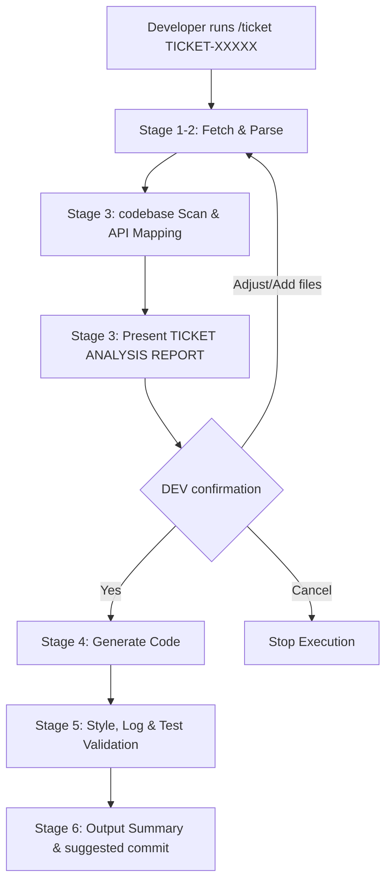

# 📖 Technical Specification: `/ticket` Command

This document details the architecture, execution flow, rules, and safety guardrails of the `/ticket` automation workflow.

---

## 🛠️ System Overview

The `/ticket` command is a guided, state-by-stage workflow designed to ingest a JIRA ticket, analyze the target codebase, propose an implementation approach, and generate compliant code while maintaining a **mandatory human confirmation gate** before any file modifications.



---

## 🚦 Execution Stages

| Stage | Name | Description | Enforced Guardrails |
| :---: | :--- | :--- | :--- |
| **1** | **Fetch** | Retrieves issue data from JIRA REST API | Uses credentials defined in local `.env.local` |
| **2** | **Parse** | Extracts summary, acceptance criteria, attachments, and metadata | Identifies language and tech stack automatically |
| **3** | **Analyze** | Scans codebase, maps dependencies, and drafts fix plan | **Generates Analysis Report & stops for Dev confirmation** |
| **4** | **Generate** | Writes or updates code in approved scope | Minimal change set, respecting project conventions |
| **5** | **Validate** | Verifies code style, logging policies, and unit tests | Validates code against rule docs in target `docs/` |
| **6** | **Output** | Proposes changes, lists risks, and generates git commit msg | Ready for developer to test and stage |

---

## 🔍 Rule Discovery & Priority Order

To align code generation with the unique styling and architecture of your repository, the agent resolves project rules in the following order:

1.  **Repository `docs/` directory**: Primary rules defined by the team (e.g. `docs/coding_style.md`, `docs/logging_policy.md`).
2.  **Repository-level instructions**: Prompt guidelines (e.g. `.github/copilot-instructions.md`) only if they add constraints beyond `docs/`.
3.  **Local Prompts**: Fallbacks defined in `ticket-agent.md` and `ticket-processor.prompt.md`.

> [!WARNING]
> If any of the typical project rules (`docs/coding_style.md`, `docs/logging_policy.md`, `docs/test_rules.md`, `docs/review_guideline.md`) are missing, the installation script will emit warnings. You should create these files to ensure the agent writes correct, production-grade code.

---

## 📋 Stage 3 Output Contract

Every **Ticket Analysis Report** generated in Stage 3 must adhere to the following template structure and match the developer's language (e.g. Vietnamese input results in Vietnamese output).

```text
----------
TICKET: <ID>
TITLE: <summary>
STATUS: <status>
----------

Type: <type>
Priority: <priority>
Estimated Scope: <small|medium|large>

Affected Modules:
- <module 1>
- <module 2>

APIs Involved:
- <api 1>
- <api 2>

Files to Modify/Create:
- <path 1> (<modify|create>)
- <path 2> (<modify|create>)

Code Fix Approach:
- Main change: <what logic/UI/state will be changed>
- Safety guardrails: <how regressions are prevented>
- Test update plan: <what tests will be added/updated>

Impact Flows:
1. Flow: <trigger/event>
   Function Path: <entrypoint/screen/action> -> <business function> -> <dependencies (api/db/cache/sdk)>
   Impact: <UI state / button state / loading / navigation>
   Risk: <low|medium|high>
2. Flow: <trigger/event>
   Function Path: <entrypoint/screen/action> -> <business function> -> <dependencies (api/db/cache/sdk)>
   Impact: <cache / timer / retry / side effects>
   Risk: <low|medium|high>

Related patterns and references:
- <project bug or review pattern knowledge base>
- <known release bug if relevant>

Confirmation:
- [ ] Yes, generate code
- [ ] Adjust analysis
- [ ] Add files
- [ ] Cancel
```

---

## 📂 Configuration Entry Points

- **Installer & Entrypoint**:
  - Chat slash command prompt: [ticket.prompt.md](ticket.prompt.md) (copied to `.github/prompts/ticket.prompt.md`)
  - Manual setup guide: [SETUP.md](SETUP.md)
- **Agent Specification & Rules**:
  - System behavioral guidelines: [ticket-agent.md](ticket-agent.md)
  - Processing logic and report templates: [ticket-processor.prompt.md](ticket-processor.prompt.md)

---

## 🔒 Security & Privacy Practices

> [!IMPORTANT]
> - **Zero Credentials Committed**: Never commit your `.env.local` file. It is added to your target project's `.gitignore` by default.
> - **No PII in Logs**: The agent is strictly forbidden from printing JIRA tokens, passwords, emails, or personal identifiable information (PII) to outputs or log streams.
> - **Scope Control**: The agent will only touch the files listed and approved by you in the Stage 3 report.

---

## 🔧 Troubleshooting

| Issue | Root Cause | Resolution |
| :--- | :--- | :--- |
| **Ticket fetch fails** | Missing or incorrect API token/credentials | Verify `JIRA_TOKEN`, `JIRA_EMAIL`, and `JIRA_URL` in `.env.local`. |
| **Analysis is incomplete** | Insufficient context or missing rule files | Add detail files in `docs/` or adjust the request and specify missing modules/files. |
| **Incorrect code style** | Missing style guidelines | Write guidelines in `docs/coding_style.md` and request regeneration. |
