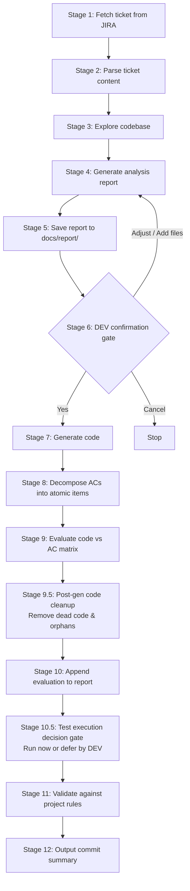

# Architecture Reference — `/ticket` workflow

This document is the technical reference for the `/ticket` command.  
For first-time setup, see [SETUP.md](SETUP.md). For a quick overview, see [README.md](README.md).

---

## System overview

The `/ticket` command is a **12-stage pipeline with intermediate checkpoints (9.5, 10.5)** that takes a JIRA ticket ID as input and produces:
1. A saved analysis report (pre-generate)
2. Implementation code
3. A post-generate AC evaluation appended to the same report

The pipeline has a **mandatory human gate** at Stage 6 — no code is written before explicit DEV confirmation.


```mermaid
flowchart TD
    S1[Stage 1: Fetch ticket from JIRA] --> S2
    S2[Stage 2: Parse ticket content] --> S3
    S3[Stage 3: Explore codebase] --> S4
    S4[Stage 4: Generate analysis report] --> S5
    S5[Stage 5: Save report to docs/report/] --> S6
    S6{Stage 6: DEV confirmation gate}
    S6 -->|Yes| S7
    S6 -->|Adjust / Add files| S4
    S6 -->|Cancel| STOP[Stop]
    S7[Stage 7: Generate code] --> S8
    S8[Stage 8: Decompose ACs into atomic items] --> S9
    S9[Stage 9: Evaluate code vs AC matrix] --> S95
    S95[Stage 9.5: Post-gen code cleanup<br/>Remove dead code & orphans] --> S10
    S10[Stage 10: Append evaluation to report] --> S105
    S105[Stage 10.5: Test execution decision gate<br/>Run now or defer by DEV] --> S11
    S11[Stage 11: Validate against project rules] --> S12
    S12[Stage 12: Output commit summary]
```

---

## Stage reference

| Stage | Name | Output | Gate? |
|:---:|---|---|:---:|
| 1 | Fetch ticket | Raw JIRA ticket data | |
| 2 | Parse ticket content | Structured fields, ACs, attachments | |
| 3 | Explore codebase | Affected modules, files, APIs | |
| 4 | Generate analysis report | Section 1 of report (in chat) | |
| 5 | Save analysis report | `docs/report/<TICKET-ID>_reports_<YYYYMMDDHHmm>.md` | |
| 6 | DEV confirmation | Explicit Yes / Adjust / Add files / Cancel | ⚠️ |
| 7 | Generate code | Changed/created source files | |
| 8 | Decompose ACs | Atomic AC items (5-pass decomposition) | |
| 9 | Evaluate code | AC matrix (Met/Partially Met/Not Met/Unclear) | |
| **9.5** | **Post-gen code cleanup** | **Dead code + orphaned refs removed** | |
| 10 | Append evaluation | Sections 2.1–2.3 + Section 3 added to report file | |
| **10.5** | **Test execution decision gate** | **DEV chooses: run now / run later / skip for now** | ⚠️ |
| 11 | Validate | Style, logging, test, review pattern compliance | |
| 12 | Output commit summary | Commit-ready summary and message | |

---

## Report file structure

One file per ticket. Created at Stage 5, extended at Stage 10.

```
docs/report/<TICKET-ID>_reports_<YYYYMMDDHHmm>.md

├── ## 1. Pre-generate analysis report
│   ├── 1.1 Ticket header
│   ├── 1.2 Affected modules
│   ├── 1.3 APIs involved
│   ├── 1.4 Files to modify / create
│   ├── 1.5 Code fix approach
│   ├── 1.6 Impact flows
│   ├── 1.7 Related patterns and references
│   └── 1.8 Confirmation
│
├── ## 2. Post-generate code evaluation      ← appended at Stage 10
│   ├── 2.1 Detailed per-AC mapping
│   ├── 2.2 Acceptance condition coverage summary
│   └── 2.3 Abnormal-case matrix (when applicable)
│
└── ## 3. Final conclusions                  ← appended at Stage 10
```

For the exact template of each section, see [ticket-processor.prompt.md](ticket-processor.prompt.md).

---

## AC decomposition — 5 passes

Before evaluation (Stage 8), every acceptance condition is decomposed into **atomic items** — the smallest independently testable unit.

| Pass | Rule | Example |
|---|---|---|
| 1 — Structural split | Split on `if/else/when/and/or` that produce different outcomes | "If A → X; else → Y" → `AC-01-a` + `AC-01-b` |
| 2 — Condition-value split | One AC per discrete input value (error code, HTTP status, enum, role…) | "Show dialog for ERR001, ERR002" → two ACs |
| 3 — Lifecycle/timing split | One AC per lifecycle point (on-success, on-dismiss, on-timeout…) | "Show dialog; on close return to source" → two ACs |
| 4 — Side-effect split | One AC per observable side effect (navigation, API call, data write, log…) | "Block API-B and show toast" → two ACs |
| 5 — Negative/boundary split | Negative conditions are standalone ACs, not notes on the positive AC | "Do NOT call API-B on failure" is its own AC |

Each atomic AC label: `AC-<group>-<sub>` (e.g., `AC-03-a`, `AC-03-b`).  
If no explicit AC exists in the ticket, derive from requirement text and label `(derived)`.

---

## Rule discovery order

The agent loads project rules in this order:

1. `docs/` directory (coding style, code review, logging, test rules, dev policy, bug patterns)
2. Repository-level AI instruction file — only for constraints not covered by `docs/`
3. Documents linked from that instruction file

---

## File roles

| File | Role |
|---|---|
| [ticket.prompt.md](ticket.prompt.md) | Slash-command entry point — thin dispatcher |
| [ticket-agent.md](ticket-agent.md) | Stage-by-stage behavior, AC decomposition rules, JIRA security policy |
| [ticket-processor.prompt.md](ticket-processor.prompt.md) | Report schema and output templates for all sections |
| [SETUP.md](SETUP.md) | First-time credential and environment setup |
| [README.md](README.md) | Quick start and overview |

---

## Security practices

- Credentials are loaded from `.env.local` — never committed to the repository.
- The agent uses `curl -u "$JIRA_EMAIL:$JIRA_TOKEN"` — credentials are never base64-encoded at runtime.
- `pwsh` / `powershell` are never invoked to fetch ticket data.
- No JIRA tokens, emails, or PII are written to logs or report files.
- The agent only touches files listed and approved in the Stage 6 report.

---

## Troubleshooting

| Symptom | Likely cause | Resolution |
|---|---|---|
| Ticket fetch fails | Wrong or missing credentials | Check `JIRA_TOKEN`, `JIRA_EMAIL`, `JIRA_URL` in `.env.local` |
| Analysis is incomplete | Missing rule files in `docs/` | Add the missing rule documents; see [SETUP.md § Project rules](SETUP.md) |
| Generated code has wrong style | Missing coding style doc | Create `docs/coding_style.md` and re-run |
| CrowdStrike alert on fetch | Using `base64` or `powershell` at runtime | Ensure agent uses `curl -u` as specified in `ticket-agent.md` |
| Report not saved | `docs/report/` directory missing | Create the directory: `mkdir -p docs/report` |
